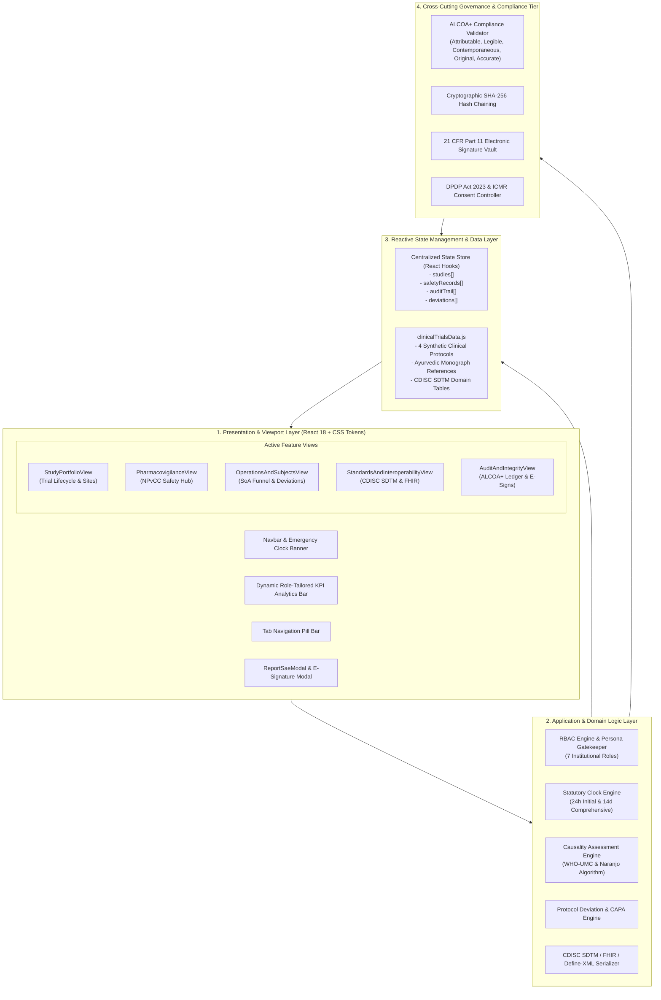
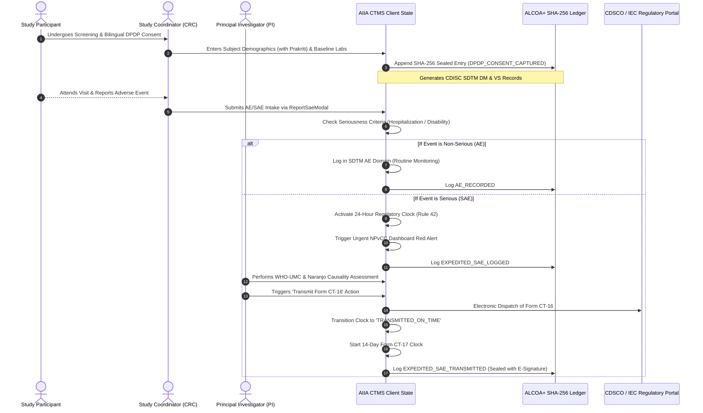
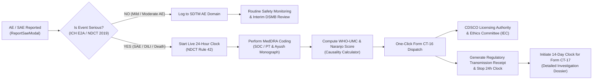
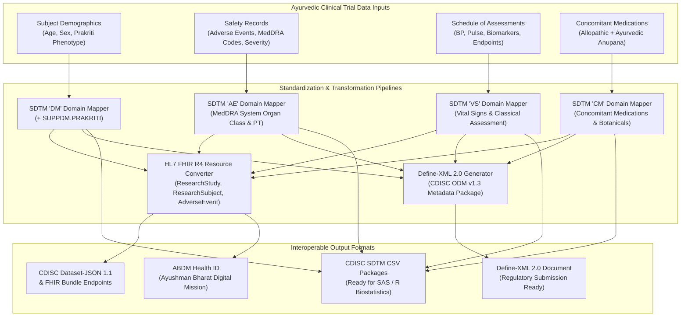
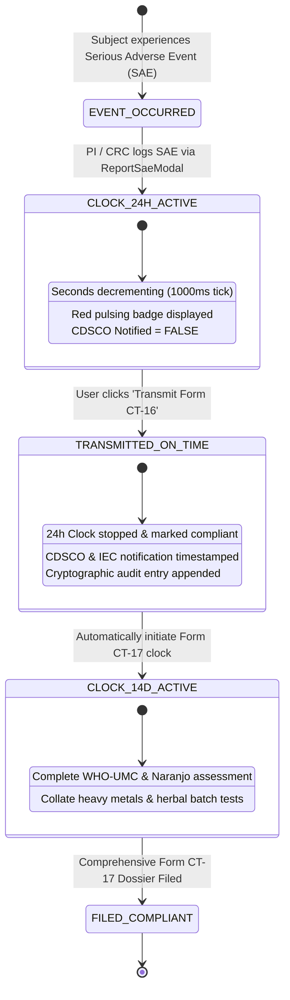

# AIIA Clinical Trials Dashboard & NPvCC CTMS Platform
> **Real-Time, Cloud-Based, GCP-Compliant Clinical Trial Management System (CTMS) for Ayurveda Research**  
> Hosted by the **All India Institute of Ayurveda (AIIA)** • Anchoring the **National Pharmacovigilance Coordination Centre (NPvCC)** for ASU&H Drugs • Ministry of Ayush, Government of India.

---

## 📑 Table of Contents
1. [Executive Summary & Institutional Context](#-executive-summary--institutional-context)
2. [Problem Statement & How We Solved It](#-problem-statement--how-we-solved-it)
3. [System Architecture](#-system-architecture)
   - [High-Level Layered Architecture](#high-level-layered-architecture)
   - [Architectural Layers & Subsystems](#architectural-layers--subsystems)
4. [Data Flow Architecture](#-data-flow-architecture)
   - [End-to-End Clinical Data Lifecycle](#end-to-end-clinical-data-lifecycle)
   - [Adverse Event & Safety Triage Data Flow](#adverse-event--safety-triage-data-flow)
   - [CDISC SDTM & HL7 FHIR Ingestion & Export Flow](#cdisc-sdtm--hl7-fhir-ingestion--export-flow)
5. [Control Flow Architecture](#-control-flow-architecture)
   - [Role-Based Access Control (RBAC) State Machine](#role-based-access-control-rbac-state-machine)
   - [24-Hour & 14-Day Statutory Regulatory Clock Workflow](#24-hour--14-day-statutory-regulatory-clock-workflow)
   - [21 CFR Part 11 E-Signature & Audit Trail Execution](#21-cfr-part-11-e-signature--audit-trail-execution)
6. [Component Architecture & Modular Breakdown](#-component-architecture--modular-breakdown)
7. [Clinical & Regulatory Compliance Matrix](#-clinical--regulatory-compliance-matrix)
8. [Data Models & Schema Reference](#-data-models--schema-reference)
9. [Project Directory Structure](#-project-directory-structure)
10. [Local Development & Deployment Guide](#-local-development--deployment-guide)

---

## 🏛 Executive Summary & Institutional Context

The **All India Institute of Ayurveda (AIIA)**, New Delhi, is the apex institute for Ayurvedic education and clinical research under the Ministry of Ayush, Government of India. In addition to conducting Phase II–IV randomized controlled trials, AIIA anchors the **National Pharmacovigilance Coordination Centre (NPvCC)** for Ayurveda, Siddha, Unani, and Homoeopathy (ASU&H) drugs.

Clinical research in traditional systems of medicine faces a dual imperative:
1. **Preserving Ayurvedic Integrity**: Capturing classical phenotypic classifications (*Prakriti*, *Agni*, *Kostha*, *Dhatu Sarata*), botanical monograph specifications (*Charaka Samhita*, *Sushruta Samhita*, *Sahasrayogam*), and holistic multi-modal therapeutic regimens.
2. **Adhering to International Regulatory Standards**: Demonstrating full compliance with **New Drugs and Clinical Trials (NDCT) Rules 2019**, **ICMR Ethical Guidelines 2017**, **Good Clinical Practice for ASU drugs (GCP-ASU)**, **US FDA 21 CFR Part 11**, **CDISC SDTM v3.3**, **HL7 FHIR R4**, and India's **Digital Personal Data Protection (DPDP) Act 2023**.

The **AIIA CTMS & NPvCC Safety Platform** bridges this divide by delivering a cloud-based, audit-ready clinical trial management system engineered specifically for ASU&H drug validation and pharmacovigilance surveillance.

---

## 🎯 Problem Statement & How We Solved It

| Clinical / Regulatory Challenge | Traditional Limitation | How This Project Solved It |
| :--- | :--- | :--- |
| **Strict 24-Hour Regulatory Clock (NDCT 2019 Rule 42)** | Investigational sites frequently breach the statutory 24-hour initial reporting requirement to CDSCO and Ethics Committees due to manual paperwork. | **Live Ticking Regulatory Clock Engine**: An active countdown timer tracks hours, minutes, and seconds until the 24-hour deadline. Features one-click Form CT-16 dispatch with automatic receipt generation and 14-day Form CT-17 clock initiation. |
| **Ayurvedic ADR Causality Assessment** | Western algorithms fail to evaluate botanical adjuvants (*Anupana*), classical processing (*Samskara*), and Herbo-Mineral preparations (*Rasa Aushadhies*). | **Dual WHO-UMC & Naranjo Causality Engine**: Real-time interactive causality calculator integrating dechallenge, rechallenge, alternative causes, and botanical monograph verification (AAS/ICP-MS heavy metal limits, aflatoxins). |
| **Multi-Stakeholder Segregation of Duties** | Existing tools either lack role isolation or provide rigid silos that impede institutional oversight. | **7-Persona Dynamic RBAC**: Live perspective switching across Institutional Director, Principal Investigator (PI), Clinical Research Coordinator (CRC), Clinical Research Associate (CRA), Ethics Committee (IEC), NPvCC Safety Officer, and CDSCO Inspector. |
| **Standardized Global Data Sharing (CDISC / FHIR)** | Ayurvedic trial data is isolated in proprietary formats, making FDA/EMA/CDSCO meta-analyses difficult. | **Native CDISC SDTM v3.3 & HL7 FHIR R4 Engine**: Pre-built mappings for `DM` (Demographics with Prakriti extension), `AE` (Adverse Events), `VS` (Vital Signs), and `CM` (Concomitant Medications), plus live Define-XML 2.0 and FHIR JSON generation. |
| **ALCOA+ Data Integrity & E-Signatures** | Paper crfs and spreadsheets lack non-repudiation, tamper evidence, and detailed change justifications. | **Cryptographic SHA-256 Audit Trail & 21 CFR Part 11 E-Signature**: Every data change captures timestamp, user identity, IP address, old/new values, mandatory clinical justification, and a SHA-256 hash seal. |
| **DPDP Act 2023 Subject Consent Tracking** | Lack of digital auditability for voluntary informed consent, vernacular translations, and consent revocation. | **Digital Bilingual Consent Lifecycle Tracker**: Monitors informed consent versions, audio-video recordings, Hindi/English language forms, and subject withdrawal states. |

---

## 🏗 System Architecture

### High-Level Layered Architecture

The platform follows a modern, decoupled **Client-Side Single-Page Architecture (SPA)** built with React 18 and Vite, structured into four cohesive layers with a cross-cutting security and governance tier:



---

### Architectural Layers & Subsystems

#### 1. Presentation & Viewport Layer
- **Component Design System**: Built with CSS custom properties (`:root` variables) supporting instantaneous light/dark theme switching, glassmorphic navigation headers, and responsive CSS grid/flex layouts.
- **Micro-Interactions & Real-Time Indicators**: Live pulsing red warning badges on urgent statutory clocks, animated notification toasts, and accessible modal dialogs with backdrop blur.
- **Zero Heavy UI Dependencies**: Fast load performance achieved with zero bloat—utilizing lightweight `lucide-react` icons and vanilla CSS tokens.

#### 2. Application & Domain Logic Layer
- **Role Controller (`RBAC`)**: Evaluates the currently selected persona (`DIRECTOR`, `PI`, `CRC`, `CRA`, `IEC`, `NPVCC`, `AUDITOR`) to filter KPI cards, highlight priority action buttons, and toggle permission-gated triggers.
- **Safety & Regulatory Clock Engine**: An active interval timer decrementing the 24-hour statutory deadline per NDCT Rules 2019 Rule 42. Dispatches expedited alerts and transitions record state upon regulatory transmission.
- **Causality Assessment Engine**: Implements the Naranjo Probability Scale algorithm and WHO-UMC causality classification based on 4 clinical parameters (temporal sequence, dechallenge, rechallenge, alternative etiology).
- **Standards Serialization Service**: Converts in-memory clinical trial objects into CDISC SDTM v3.3 datasets (`DM`, `AE`, `VS`, `CM`), Define-XML 2.0 documents, and HL7 FHIR R4 JSON resources.

#### 3. Reactive State Management Layer
- **Unidirectional State Flow**: Centralized at the root `App.jsx` component, orchestrating mutations across studies, adverse event logs, audit records, and deviation registers.
- **Deterministic Seeding**: Pre-loaded with clinically accurate synthetic trials representing actual Ayurvedic research paradigms (e.g., Withania somnifera in post-viral fatigue, Nishakathakadi Kashaya in T2DM, Rasa Aushadhi heavy-metal safety registries).

#### 4. Cross-Cutting Governance & Security Tier
- **ALCOA+ Integrity Engine**: Enforces that every audit log entry is **A**ttributable (user name and IP), **L**egible, **C**ontemporaneous (UTC/IST timestamp), **O**riginal, and **A**ccurate.
- **Cryptographic SHA-256 Hashing**: Generates cryptographically secure hashes for all state mutations via the Web Crypto API (`crypto.getRandomValues`), creating an immutable tamper-evident chain.
- **21 CFR Part 11 Electronic Signature System**: Enforces dual-factor intent with mandatory clinical justification before committing critical actions (such as database lock, protocol amendments, or SAE transmission).

---

## 🔄 Data Flow Architecture

### End-to-End Clinical Data Lifecycle

The following sequence details how clinical data travels from subject screening through eCRF entry, audit logging, and external regulatory submission:



---

### Adverse Event & Safety Triage Data Flow



---

### CDISC SDTM & HL7 FHIR Ingestion & Export Flow



---

## 🕹 Control Flow Architecture

### Role-Based Access Control (RBAC) State Machine

The application features an interactive persona switcher in the navigation bar. Changing the role dynamically adjusts view rendering, KPI metrics, and functional authorizations:

```mermaid
stateDiagram-v2
    [*] --> DIRECTOR : Initial App Load

    state "Director / Leadership" as DIRECTOR {
        DIRECTOR : Macro Portfolio Accrual Velocity
        DIRECTOR : Institutional Budget Burn-down
        DIRECTOR : High-level Safety Alerts
    }

    state "Principal Investigator (PI)" as PI {
        PI : Protocol Oversight & Deviations
        PI : eCRF Source Data Verification
        PI : SAE Sign-off & Causality Assessment
    }

    state "Study Coordinator (CRC)" as CRC {
        CRC : Subject Enrollment & Scheduling
        CRC : Schedule of Assessments (SoA) Matrix
        CRC : Initial AE Reporting Intake
    }

    state "Monitor / CRA" as CRA {
        CRA : Site Initiation & Monitoring Visits
        CRA : Protocol Deviation Logging (CAPA)
        CRA : SDV Query Management
    }

    state "Institutional Ethics Committee (IEC)" as IEC {
        IEC : Annual Continuing Reviews
        IEC : 24h Expedited Safety Notifications
        IEC : Protocol Amendment Approvals
    }

    state "NPvCC Safety Officer" as NPVCC {
        NPVCC : National ASU&H ADR Triage
        NPVCC : Live 24h / 14d Regulatory Countdown Clocks
        NPVCC : Form CT-16 / CT-17 CDSCO Dispatch
    }

    state "CDSCO Inspector (Auditor)" as AUDITOR {
        AUDITOR : Read-Only ALCOA+ Audit Ledger
        AUDITOR : 21 CFR Part 11 Electronic Signature Verification
        AUDITOR : CDISC SDTM & Define-XML Export Inspection
    }

    DIRECTOR --> PI : Role Selector
    PI --> CRC : Role Selector
    CRC --> CRA : Role Selector
    CRA --> IEC : Role Selector
    IEC --> NPVCC : Role Selector
    NPVCC --> AUDITOR : Role Selector
    AUDITOR --> DIRECTOR : Role Selector
```

---

### 24-Hour & 14-Day Statutory Regulatory Clock Workflow



---

### 21 CFR Part 11 E-Signature & Audit Trail Execution

To satisfy US FDA 21 CFR Part 11, CDSCO Good Clinical Practice guidelines, and the DPDP Act 2023:
1. Every critical event triggers an **Electronic Signature Verification Modal**.
2. The user selects the regulatory action type (e.g., `DATABASE_LOCK_VERIFICATION`, `EXPEDITED_SAE_DISPATCH`, `PROTOCOL_AMENDMENT_SIGN_OFF`).
3. The user inputs a mandatory, auditable **Clinical Justification / Reason for Change**.
4. The system cryptographically captures the session user, assigned role, client IP address, UTC timestamp, and generates a **SHA-256 cryptographic digest**.
5. The entry is prepended to the immutable audit trail and rendered in the **ALCOA+ Governance View**.

---

## 🧩 Component Architecture & Modular Breakdown

The application is structured into modular components within `src/components/`:

```
src/
├── App.jsx                                # Central state orchestrator, clock tickers & toast provider
├── App.css                                # Layout containers, transitions & responsive design
├── index.css                              # Design system tokens, color palettes & button primitives
├── main.jsx                               # React DOM entry point
├── assets/                                # Static images, icons & emblems
├── data/
│   └── clinicalTrialsData.js              # Complete mock database: studies, SAEs, SDTM, audit logs
└── components/
    ├── Navbar.jsx                         # Top bar: branding, role dropdown, theme toggle, emergency clock
    ├── KpiOverview.jsx                    # Contextual KPI tiles tailored by current user role
    ├── StudyPortfolioView.jsx             # Portfolio overview, multicentric site tracking & CTRI deadlines
    ├── PharmacovigilanceView.jsx          # NPvCC safety hub, Form CT-16 transmission & causality tool
    ├── OperationsAndSubjectsView.jsx      # Participant funnels, SoA visit matrix & protocol deviations
    ├── StandardsAndInteroperabilityView.jsx# CDISC SDTM v3.3 browser, Define-XML & HL7 FHIR explorer
    ├── AuditAndIntegrityView.jsx          # ALCOA+ ledger, SHA-256 hash verify & 21 CFR Part 11 e-sign modal
    └── ReportSaeModal.jsx                 # Rapid emergency AE/SAE intake modal with MedDRA coding
```

### Detailed Component Responsibilities

#### [`App.jsx`](file:///c:/Users/HP/Downloads/Ayurveda/src/App.jsx)
- **Primary State Store**: Holds `studies`, `safetyRecords`, `auditTrail`, and `deviations`.
- **Statutory Ticking Engine**: Runs a 1-second `setInterval` managing `secondsRemaining` for the live 24-hour NDCT regulatory clock.
- **Root Event Handlers**:
  - `handleTransmitToCdsco(saeId)`: Flips safety record state to `TRANSMITTED_ON_TIME`, dispatches toast, and appends a SHA-256 audit entry.
  - `handleReportNewSafetyRecord(newRecord)`: Inserts new AE/SAE, updates protocol SAE counters, and logs regulatory intake.
  - `handleAddAuditEntry(entry)`: Receives signed entries from the 21 CFR Part 11 e-signature modal.

#### [`Navbar.jsx`](file:///c:/Users/HP/Downloads/Ayurveda/src/components/Navbar.jsx)
- Renders institutional insignia for **AIIA** and the **NPvCC Ayush Wing**.
- Displays the **Live Emergency Statutory Clock Countdown** with a pulsing alert badge.
- Hosts the **Interactive Role Switcher Menu** allowing instant navigation across all 7 user personas.
- Houses the dark/light mode toggle and one-click **"Report AE/SAE"** quick action trigger.

#### [`KpiOverview.jsx`](file:///c:/Users/HP/Downloads/Ayurveda/src/components/KpiOverview.jsx)
- Renders 4 high-impact metric cards dynamically adjusted to the active role:
  - *Director*: Active protocols, total target recruitment, active SAE alerts, institutional budget burn.
  - *PI*: Lead studies, enrolled vs target, pending queries, protocol deviations.
  - *NPvCC Officer*: 24h expedited clock countdown, total ADRs, WHO-UMC causality distribution, DSMB alerts.
  - *Auditor*: ALCOA+ compliance percentage, SHA-256 verified entries, 21 CFR Part 11 signatures, CDISC readiness.

#### [`StudyPortfolioView.jsx`](file:///c:/Users/HP/Downloads/Ayurveda/src/components/StudyPortfolioView.jsx)
- Displays 4 pre-seeded clinical protocols with detailed therapeutic areas, investigational products, and classical Ayurvedic literature references (*Charaka Samhita*, *Sahasrayogam*, *Bhavaprakasha Nighantu*).
- Features interactive site accrual progress bars across apex national institutes (AIIA New Delhi, IPGT&RA Jamnagar, NIA Jaipur, IMS BHU Varanasi).
- Tracks regulatory milestones: Scientific Advisory Committee (SAC), Institutional Ethics Committee (IEC) validity dates, CTRI prospective registration, and data-lock timelines.

#### [`PharmacovigilanceView.jsx`](file:///c:/Users/HP/Downloads/Ayurveda/src/components/PharmacovigilanceView.jsx)
- Serves as the operational hub for the **National Pharmacovigilance Coordination Centre (NPvCC)**.
- Color-coded safety table categorizing events by severity, seriousness criteria, and MedDRA System Organ Class (SOC).
- Features the **WHO-UMC & Naranjo Interactive Causality Calculator** allowing real-time score adjustment based on dechallenge, rechallenge, and concomitant drugs.
- Includes the **"Transmit Form CT-16 to CDSCO"** action button, stopping the regulatory clock and generating an official dispatch receipt.

#### [`OperationsAndSubjectsView.jsx`](file:///c:/Users/HP/Downloads/Ayurveda/src/components/OperationsAndSubjectsView.jsx)
- **Accrual Funnel**: Visualizes conversion from Screened $\rightarrow$ Randomized $\rightarrow$ Completed $\rightarrow$ Discontinued.
- **Schedule of Assessments (SoA) Matrix**: Tracks clinical visits (Screening, Baseline, Week 4, Week 8, Week 12) alongside mandatory protocol procedures (Prakriti assessment, heavy metal biomonitoring, HbA1c, WOMAC score).
- **Participant Directory**: De-identified cohort view with Prakriti phenotypes (*Vata-Pitta*, *Kapha-Vata*, etc.) and ABDM ABHA health IDs.
- **Protocol Deviations Registry**: Categorizes minor vs major deviations with root cause impact and Corrective and Preventive Actions (CAPA).

#### [`StandardsAndInteroperabilityView.jsx`](file:///c:/Users/HP/Downloads/Ayurveda/src/components/StandardsAndInteroperabilityView.jsx)
- **CDISC SDTM v3.3 Browser**: Tabular preview and one-click CSV / JSON download of standard regulatory submission domains:
  - `DM` (Demographics with Ayurvedic Prakriti variable)
  - `AE` (Adverse Events with MedDRA Preferred Term and SOC)
  - `VS` (Vital Signs: Systolic BP, Diastolic BP, Pulse Rate)
  - `CM` (Concomitant Medications)
- **Define-XML 2.0 Generator**: Formats compliant XML metadata adhering to CDISC ODM v1.3 standards.
- **HL7 FHIR R4 Explorer**: Validates synthetic JSON resources for `ResearchStudy`, `ResearchSubject`, and `AdverseEvent`.

#### [`AuditAndIntegrityView.jsx`](file:///c:/Users/HP/Downloads/Ayurveda/src/components/AuditAndIntegrityView.jsx)
- **ALCOA+ Governance Grid**: Explains and validates the 8 pillars of data integrity.
- **Real-Time Searchable Audit Ledger**: Filters entries by user, study, action type, or target field.
- **Cryptographic SHA-256 Verifier**: Displays full 64-character hexadecimal SHA-256 digest strings proving non-repudiation.
- **21 CFR Part 11 E-Signature Modal**: Allows authenticated users to apply electronic signatures with mandatory clinical justification.

#### [`ReportSaeModal.jsx`](file:///c:/Users/HP/Downloads/Ayurveda/src/components/ReportSaeModal.jsx)
- Expedited clinical intake modal capturing subject ID, adverse event term, MedDRA System Organ Class, severity grade (CTCAE v5.0), and seriousness criteria.
- Captures Ayurvedic product batch numbers and botanical quality parameters (heavy metal AAS/ICP-MS certification, microbial contamination tests).
- Automatically initializes the 24-hour statutory countdown upon submission.

---

## ⚖ Clinical & Regulatory Compliance Matrix

| Regulatory / Data Standard | Scope & Mandate | Platform Implementation in AIIA CTMS |
| :--- | :--- | :--- |
| **NDCT Rules 2019 (Rule 42)** | Mandatory 24-hour expedited initial reporting of Serious Adverse Events to CDSCO & IEC; Form CT-17 within 14 days. | Live 24-hour countdown clock on top banner & safety hub; one-click Form CT-16 transmission; 14-day tracking workflow. |
| **GCP-ASU Guidelines** | Good Clinical Practice guidelines tailored for ASU drugs by the Ministry of Ayush. | Classical botanical reference mapping (*Charaka Samhita*, *Sahasrayogam*); standardized *Anupana* and batch quality logs. |
| **US FDA 21 CFR Part 11** | Requirements for electronic records, electronic signatures, and tamper-evident audit trails. | Cryptographic SHA-256 audit chaining; e-signature modal capturing user, role, IP, timestamp, and clinical justification. |
| **ALCOA+ Principles** | Attributable, Legible, Contemporaneous, Original, Accurate + Complete, Consistent, Enduring. | Complete audit trail view with real-time search, non-destructive state mutations, and permanent reason-for-change logging. |
| **CDISC SDTM v3.3** | Study Data Tabulation Model for regulatory submission (US FDA, PMDA, CDSCO). | Standardized `DM`, `AE`, `VS`, and `CM` domains with instant CSV / Dataset-JSON export and Define-XML 2.0 generator. |
| **HL7 FHIR R4** | International healthcare data exchange standard for clinical research. | Validated JSON schemas for `ResearchStudy`, `ResearchSubject`, and `AdverseEvent` resources. |
| **DPDP Act 2023 (India)** | Digital Personal Data Protection Act compliance for subject privacy and consent. | De-identified subject IDs, masked ABHA identifiers, and auditable digital bilingual consent tracking. |
| **CTRI Prospective Registration** | Mandatory prospective trial registration with the Clinical Trials Registry - India. | Dedicated CTRI ID badge, registration date tracking, and 6-month status update countdown warnings. |

---

## 📊 Data Models & Schema Reference

### 1. Clinical Study Model (`INITIAL_STUDIES`)
```javascript
{
  id: 'AIIA-CT-2024-001',
  protocolNumber: 'AIIA/KAYA/2024/01',
  ctriId: 'CTRI/2024/03/064210',
  title: 'Evaluation of Standardized Withania somnifera Extract in Post-Viral Fatigue',
  shortTitle: 'Ashwagandha in Post-Viral Fatigue (Phase III)',
  phase: 'Phase III',
  studyType: 'Interventional Randomized Double-Blind Multi-Centre',
  therapeuticArea: 'Kayachikitsa (Internal Medicine) / Immunology',
  investigationalProduct: 'Ashwagandha Extract (500mg BID, standardized to 5% withanolides)',
  comparator: 'Identical Microcrystalline Cellulose Placebo Capsule',
  classicalReference: 'Charaka Samhita, Sutrasthana 4/13 (Balya Mahakashaya)',
  status: 'Recruiting',
  leadPi: 'Dr. Anand Kumar, MD (Ayu)',
  participatingSites: [
    { name: 'AIIA, New Delhi (Apex)', target: 90, enrolled: 78, pi: 'Dr. Anand Kumar' },
    { name: 'IPGT&RA, Jamnagar (Gujarat)', target: 50, enrolled: 44, pi: 'Dr. H. M. Chandola' }
  ],
  targetEnrollment: 240,
  currentEnrolled: 195,
  screened: 278,
  randomized: 195,
  completed: 112,
  discontinued: 9,
  iecApprovalDate: '2024-02-14',
  ctriRegDate: '2024-03-01',
  primaryEndpoint: 'Mean change in Chalder Fatigue Scale (CFS-11) score at Week 12',
  protocolDeviations: { major: 1, minor: 4 },
  budgetAllocated: '₹ 1.45 Cr',
  budgetUtilized: '₹ 88.5 L'
}
```

### 2. Pharmacovigilance & Safety Record Model (`INITIAL_SAFETY_RECORDS`)
```javascript
{
  id: 'SAE-2024-001',
  studyId: 'AIIA-CT-2024-004',
  subjectId: 'SUBJ-SG-042',
  trialArm: 'Shallaki-Guggulu Extract (500mg BID)',
  aeTermReported: 'Drug-Induced Liver Injury (Grade 3 Transaminitis)',
  medDraPT: 'Drug-induced liver injury',
  medDraSOC: 'Hepatobiliary disorders',
  medDraCode: '10072268',
  severity: 'Severe (Grade 3)',
  seriousnessCriteria: 'Hospitalization / Medically Significant',
  isSAE: true,
  onsetTimestamp: '2026-09-28T16:30:00Z',
  regClock24hDeadline: '2026-09-29T16:30:00Z',
  regClock24hStatus: 'URGENT_ACTION_REQUIRED',
  regClock14dDeadline: '2026-10-12T16:30:00Z',
  regClock14dStatus: 'PENDING_CAUSALITY',
  whoUmcCausality: 'Possible',
  naranjoScore: 5,
  investigationalProductBatch: 'SG-GMP-2024-B04',
  ayushHerbalDetails: {
    botanicalName: 'Boswellia serrata + Commiphora mukul',
    heavyMetalsAnalysis: 'Within Ayurvedic Pharmacopoeia of India (API) limits',
    microbialContamination: 'Nil detected',
    aflatoxins: 'Negative'
  },
  actionTaken: 'Study drug permanently withdrawn; patient admitted to AIIA HDU',
  outcome: 'Recovering / Transaminases trending downward',
  iecNotified: true,
  cdscoNotified: false
}
```

### 3. ALCOA+ Audit Trail Model (`INITIAL_AUDIT_TRAIL`)
```javascript
{
  id: 'AUD-8921',
  timestamp: '2026-09-29T10:14:22Z',
  user: 'Dr. Anand Kumar (PI)',
  role: 'Principal Investigator',
  studyId: 'AIIA-CT-2024-001',
  action: 'eCRF_SIGN_OFF',
  entity: 'Subject AIIA-001-045 Week 12 Visit',
  fieldName: 'investigatorSignOffStatus',
  oldVal: 'Pending_Signature',
  newVal: 'Signed_Verified',
  reasonForChange: 'Completed source data verification and clinical outcome validation',
  ipAddress: '14.139.60.18 (AIIA Campus LAN)',
  sha256Hash: 'e3b0c44298fc1c149afbf4c8996fb92427ae41e4649b934ca495991b7852b855',
  verified21CFRPart11: true
}
```

---

## 📁 Project Directory Structure

```
Ayurveda/
├── dist/                              # Production build artifact (compiled via Vite)
├── public/                            # Static public web assets
├── src/
│   ├── assets/                        # SVGs, emblems and brand icons
│   ├── components/
│   │   ├── AuditAndIntegrityView.jsx  # ALCOA+ ledger, SHA-256 verifier, E-signature modal
│   │   ├── KpiOverview.jsx            # Dynamic 4-tile KPI bar tailored by role
│   │   ├── Navbar.jsx                 # Header with 24h statutory clock, role switcher & theme toggle
│   │   ├── OperationsAndSubjectsView.jsx # Accrual funnels, SoA visit matrix & deviation tracker
│   │   ├── PharmacovigilanceView.jsx  # NPvCC ADR hub, Form CT-16 dispatch & causality calculator
│   │   ├── ReportSaeModal.jsx         # Emergency AE/SAE rapid intake modal with MedDRA coding
│   │   ├── StandardsAndInteroperabilityView.jsx # CDISC SDTM, Define-XML & HL7 FHIR exporter
│   │   └── StudyPortfolioView.jsx     # Clinical trial portfolio, multicentric sites & CTRI tracker
│   ├── data/
│   │   └── clinicalTrialsData.js      # Comprehensive synthetic database & domain definitions
│   ├── App.css                        # App layout, responsive design & animations
│   ├── App.jsx                        # Main root component, regulatory clock ticker & event handlers
│   ├── index.css                      # Design system tokens, color palettes & button primitives
│   └── main.jsx                       # Application bootstrapping
├── .gitignore                         # Git exclusion rules
├── .oxlintrc.json                     # Oxlint high-performance code linter configuration
├── index.html                         # HTML5 root with meta tags & Google fonts
├── package.json                       # Project dependencies, scripts & metadata
├── package-lock.json                  # Locked dependency graph
├── vercel.json                        # Vercel SPA routing & rewrites configuration
└── vite.config.js                     # Vite build configuration with React plugin
```

---

## 🚀 Local Development & Deployment Guide

### Prerequisites
- **Node.js**: v18.0.0 or higher
- **npm**: v9.0.0 or higher

### Local Development Setup

1. **Clone the Repository**:
   ```bash
   git clone https://github.com/vedansh0410/aiia-ctms.git
   cd aiia-ctms
   ```

2. **Install Dependencies**:
   ```bash
   npm install
   ```

3. **Start the Development Server**:
   ```bash
   npm run dev
   ```
   Open `http://localhost:5173` in your browser.

4. **Verify Code Correctness**:
   ```bash
   # Run high-performance linter
   npx oxlint
   
   # Test production build
   npm run build
   ```

---

### Free Deployment on Vercel

Vercel offers **100% free hosting** for frontend applications on their Hobby tier (includes global edge CDN, automatic HTTPS, and instant Git continuous deployment).

#### Option A: Deploy via GitHub (Recommended)

1. Push your repository to GitHub:
   ```bash
   git add .
   git commit -m "feat: complete AIIA CTMS platform documentation & architecture"
   git push origin main
   ```
2. Go to [vercel.com](https://vercel.com) and log in with your GitHub account.
3. Click **"Add New..."** $\rightarrow$ **"Project"**.
4. Import your `aiia-ctms` repository.
5. Vercel automatically detects the Vite configuration:
   - *Framework Preset*: `Vite`
   - *Build Command*: `npm run build`
   - *Output Directory*: `dist`
   - *Install Command*: `npm install`
6. Click **"Deploy"**. The site will be live at `https://aiia-ctms.vercel.app` in under 45 seconds.

#### Option B: Deploy Directly via Terminal (No GitHub Required)

1. Run the Vercel CLI directly inside the project root:
   ```bash
   npx vercel
   ```
2. Follow the interactive prompts:
   - Set up and deploy? **Y**
   - Which scope? Select your personal free account.
   - Link to existing project? **N**
   - Project name? **aiia-ctms**
   - In which directory? **./**
   - Auto-detected settings? **Y**
3. The CLI will output your live deployment URL immediately!

---

## 📜 Intellectual Property & Institutional Attribution

- **Hosting Institution**: All India Institute of Ayurveda (AIIA), New Delhi
- **Nodal Centre**: National Pharmacovigilance Coordination Centre (NPvCC) for ASU&H Drugs
- **Governing Body**: Ministry of Ayush, Government of India
- **Regulatory Framework**: New Drugs and Clinical Trials Rules 2019 • Good Clinical Practice for ASU Drugs • ICMR Ethical Guidelines
